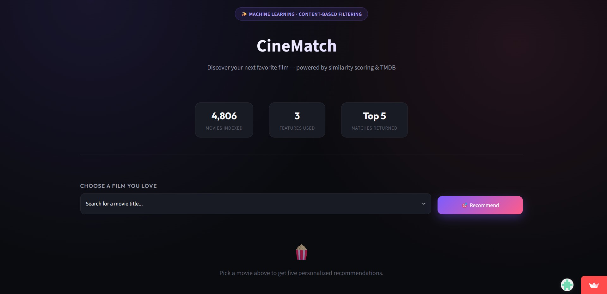

# 🎬 CineMatch — AI-Powered Movie Recommendation System

A content-based movie recommender that suggests similar films using machine learning, with live movie data pulled from TMDB and a custom-designed, dark-themed UI built in Streamlit.

🔗 Live demo: https://cinematch-ai-2026.streamlit.app/
📂 Tech: Python · Numpy · Pandas · scikit-learn · Streamlit · TMDB API · Git LFS

📸 Preview

 🧠 How It Works

CineMatch uses content-based filtering: instead of relying on other users' ratings (like Netflix-style collaborative filtering), it analyzes each movie's own metadata — genre, cast, crew, keywords, and overview — to build a feature vector per movie.

1. Movie metadata is vectorized into numerical feature vectors
2. Cosine similarity is computed between every pair of movies, producing a similarity matrix
3. When a user selects a movie, the app looks up its row in the similarity matrix and returns the 5 movies with the highest similarity scores
4. Poster, rating, and overview for each recommendation are fetched live from the TMDB API

This means recommendations are explainable — a film is suggested *because of what it's about*, not because of anonymous user behavior patterns.

 ✨ Features

- 🎯 Top-5 similar movie recommendations with a visual match-score badge and progress bar per result
- 🖼️ Live poster, rating, and release-date enrichment via TMDB
- ⚡ Cached data loading and API calls for fast repeat lookups
- 🛡️ Graceful error handling — failed API calls show a clear message instead of crashing
- 🎨 Custom dark UI with a gradient design system, equal-height result cards, and responsive layout
- 🔐 API key handled via Streamlit Secrets — never hardcoded in source

 🛠️ Tech Stack

| Layer                 | Tool |

| Language              | Python |
| Data processing       | Pandas |
| Similarity modeling   | scikit-learn (cosine similarity) |
| UI framework          | Streamlit |
| External data         | TMDB API |
| Large file storage    | Git LFS |

 🚀 Run It Locally

bash
# 1. Clone the repo
git clone https://github.com/aniketrana21/Movie_recommender_System.git
cd Movie_recommender_System

# 2. Install dependencies
pip install -r requirement.txt

# 3. Add your TMDB API key
# Create .streamlit/secrets.toml with:
# TMDB_API_KEY = "your_key_here"

# 4. Run the app
streamlit run app.py

Get a free TMDB API key at [themoviedb.org](https://www.themoviedb.org/settings/api).

 📁 Project Structure

.
├── app.py                 # Streamlit application
├── movies.pkl              # Preprocessed movie metadata
├── similarity.pkl           # Precomputed similarity matrix (tracked via Git LFS)
├── Movie_recommended_system.ipynb   # Model building & data preprocessing
├── .streamlit/
│   └── secrets.toml          # API key (not committed)
└── requirement.txt

 🗺️ Roadmap

- [ ] Genre and release-year filters
- [ ] Hybrid recommendations (content-based + collaborative filtering)
- [ ] "Surprise me" random discovery mode
- [ ] User Watchlists / session-based history

 📄 License

MIT — feel free to fork and build on this.

Built as a hands-on machine learning project to explore content-based recommendation systems end-to-end — from data preprocessing to a deployed, user-facing application.